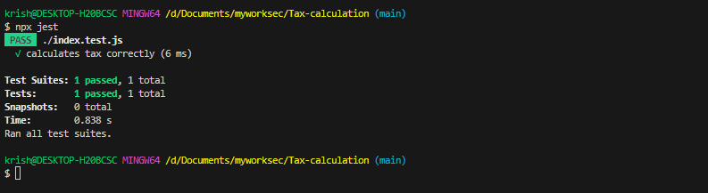

# Tax Calculator

This project is a simple tax calculator implemented using HTML, CSS, and JavaScript. It calculates the tax based on the gross annual income, extra income, deductions, and age group provided by the user.

## Prerequisites

Before you begin, ensure you have the following installed on your local machine:

- Web browser (Google Chrome, Mozilla Firefox, etc.)

## Getting Started

To get a local copy of this project up and running, follow these steps:

1. Clone this repository to your local machine using Git:

   ```bash
   git clone https://github.com/your-username/tax-calculator.git
   cd tax-calculator
2. Open the index.html file in your preferred web browser.
   
1. Fill in the required fields in the tax calculator form:

2. Gross Annual Income: Enter the gross annual income.
Extra Income: (Optional) Enter any extra income.
Deductions: (Optional) Enter any deductions.
Age: Select your age group from the dropdown.
Click the "Calculate Tax" button to see the tax calculation result.
### Tests Passing Screenshot


